# REACT

- **React**: Librería JS enfocada a desarrollar interfaces web. Permite crear complejas UIs utilizando "componentes".
  
- **Componente**: Un componente es un código aislado que indicará a React qué queremos ver en pantalla. Los componentes están vinculados con la vista.

Aquí tienes un **protocolo paso a paso** para empezar a trabajar con **React** en **Visual Studio Code (VS Code)**:

---

## **1. Instalar Node.js y npm**

React usa **Node.js** y **npm (Node Package Manager)** para manejar paquetes y dependencias.

🔹 **Descargar e instalar:**  
👉 [https://nodejs.org/](https://nodejs.org/) (Recomiendo la versión LTS para mayor estabilidad).

🔹 **Verificar instalación:**  

Abre una terminal y ejecuta:

```sh
node -v
npm -v
```

Si devuelve versiones, la instalación fue correcta.

---

## **2. Instalar Visual Studio Code**

🔹 **Descargar e instalar:**  
👉 [https://code.visualstudio.com/](https://code.visualstudio.com/)

🔹 **Extensiones recomendadas para React:**

- **ES7+ React/Redux/React-Native snippets**
- **Prettier - Code formatter** (para formateo automático)
- **React Developer Tools** (para depuración)

Para instalar extensiones, ve a **VS Code → Extensions (Ctrl + Shift + X)** y busca estos nombres.

---

## **3. Crear un Proyecto React con Vite (recomendado)**

React se puede crear con `create-react-app`, pero **Vite** es más rápido y ligero.

- **Comando para crear un nuevo proyecto con Vite:**

```sh
npm create vite@latest nombre-del-proyecto --template react
? Select a framework: › - Use arrow-keys. Return to submit.
    Vanilla
    Vue
❯   React
    Preact
    Lit
    Svelte
    Solid
    Qwik
    Angular
    Others

✔ Select a framework: › React
? Select a variant: › - Use arrow-keys. Return to submit.
❯   TypeScript
    TypeScript + SWC
    JavaScript
    JavaScript + SWC
    React Router v7 ↗
```

Reemplaza `nombre-del-proyecto` con el nombre que desees.


Las características que ebe

- **Entrar en la carpeta del proyecto:**

```sh
cd nombre-del-proyecto
```

🔹 **Instalar dependencias:**

```sh
npm install
```

---

## **4. Ejecutar el Servidor de Desarrollo**

Para ver la aplicación en el navegador, ejecuta:

```sh
npm run dev
```

Luego abre en el navegador la URL que aparece (por defecto `http://localhost:5173/`).

---

## **5. Estructura del Proyecto**

Después de crear el proyecto, verás una estructura como esta:
📂 nombre-del-proyecto
 ├── 📂 node_modules      # Paquetes instalados
 ├── 📂 public            # Archivos estáticos
 ├── 📂 src               # Código fuente
 │   ├── App.tsx          # Componente principal
 │   ├── main.tsx         # Punto de entrada
 │   ├── index.css        # Estilos globales
 ├── .gitignore           # Archivos ignorados por Git
 ├── package.json         # Configuración del proyecto
 ├── vite.config.js       # Configuración de Vite

---

## **6. Modificar el Proyecto**

- **Editar `App.jsx`:**  

Abre el archivo **`src/App.jsx`** y reemplázalo con algo simple:

```jsx
export default function App() {
  return (
    <div>
      <h1>¡Hola, React con Vite!</h1>
    </div>
  );
}
```

Guarda el archivo y revisa en el navegador.

---

## **7. Agregar Estilos**

Puedes editar **`src/index.css`** o crear archivos CSS separados y usarlos en los componentes.

Ejemplo en `App.jsx`:

```jsx
import "./App.css";

export default function App() {
  return <h1 className="titulo">¡Hola, React con Vite!</h1>;
}
```

Y en `App.css`:

```css
.titulo {
  color: blue;
  text-align: center;
}
```

---

## **8. Agregar Bootstrap o Tailwind (Opcional)**


Si quieres usar estilos predefinidos:

🔹 **Bootstrap:**

```sh
npm install bootstrap
```

Luego impórtalo en `main.jsx`:

```jsx
import "bootstrap/dist/css/bootstrap.min.css";
```

🔹 **Tailwind CSS:**  

```sh
npm install -D tailwindcss postcss autoprefixer
npx tailwindcss init -p
```

Configura `tailwind.config.js` y usa sus clases en los componentes.

---


### Pasos iniciales para crear el entorno:

1. **Instalar NodeJS**: [NodeJS](https://nodejs.org/es/)

2. **Actualizar Create React App**:  

   ```bash
   npm install react-scripts@latest
   ```

3. **Crear un proyecto con Create React App**:  

   ```bash
   npx create-react-app nombre_del_proyecto --template typescript
   ```

4. **Iniciar un proyecto (situados dentro de la carpeta del proyecto)**:  

   ```bash
   npm start -o
   ```

5. **Encapsular un proyecto (situados dentro de la carpeta del proyecto)**:  
   ```bash
   npm run build
   ```

- Modificamos `App.tsx` para agregar y eliminar contenido en la aplicación web.

---

## REACT y TypeScript

 TypeScript se integra con las características principales de React, como el uso de tipos, interfaces, y la seguridad que proporciona al trabajar con los componentes y los hooks.

```mermaid
graph LR
  A[React + TypeScript -.tsx-] --> B[Componentes con Tipos]
  A --> C[JSX + Tipos]
  A --> D[Estado -useState- con Tipos]
  A --> E[Props Tipadas]
  A --> F[Ciclo de Vida con Tipos]
  A --> G[Renderizado Virtual]

  B --> H[Componentes Funcionales con Tipos]
  B --> I[Componentes de Clase con Tipos]
  
  D --> J[useState Hook con Tipos]
  D --> K[useEffect Hook con Tipos]
  
  E --> L[Props Tipadas para Funciones]
  E --> M[Props Tipadas para Datos]
  
  F --> N[Manejo de Efectos con useEffect y Tipos]
  F --> O[Manejo de Eventos con Tipos]
  
  G --> P[Virtual DOM Tipado]
  G --> Q[Reconciliación Tipada]
  
  style A fill:#ffcc00,stroke:#333,stroke-width:4px
  style B fill:#66ccff,stroke:#333,stroke-width:2px
  style C fill:#66ccff,stroke:#333,stroke-width:2px
  style D fill:#66ccff,stroke:#333,stroke-width:2px
  style E fill:#66ccff,stroke:#333,stroke-width:2px
  style F fill:#66ccff,stroke:#333,stroke-width:2px
  style G fill:#66ccff,stroke:#333,stroke-width:2px
```



### Descripción de las Características en React con TypeScript

- **Componentes con Tipos**: El uso de TypeScript permite tipar componentes, ya sea funcionales o de clase, asegurando que las props y el estado estén correctamente definidos.
  - **Componentes Funcionales con Tipos**: Uso de funciones para definir componentes con tipos de props y estado.
  - **Componentes de Clase con Tipos**: Tipar los componentes de clase con las interfaces adecuadas para sus props y estado.

- **JSX + Tipos**: La sintaxis de JSX es compatible con TypeScript, y podemos añadir tipos a los elementos dentro del JSX.

- **Estado (useState) con Tipos**: Utilización de `useState` y su integración con los tipos de datos que se manejarán dentro del estado.
  
- **Props Tipadas**: Podemos definir las props de un componente con interfaces o tipos, asegurando la correcta validación de datos.
  - **Props Tipadas para Funciones**: Tipar las funciones que se pasan como props.
  - **Props Tipadas para Datos**: Asegurar que los datos pasados en las props tengan el tipo adecuado.

- **Ciclo de Vida con Tipos**: Usar hooks como `useEffect` con TypeScript asegura que los efectos y eventos estén correctamente tipados.
  - **Manejo de Efectos con useEffect y Tipos**: Usar efectos secundarios correctamente tipados.
  - **Manejo de Eventos con Tipos**: Tipar los eventos para asegurarse de que las interacciones del usuario sean manejadas correctamente.

- **Renderizado Virtual**: Con TypeScript, el Virtual DOM y la reconciliación están completamente tipados, asegurando que las actualizaciones del DOM sean correctas y eficientes.

## Ampliación conceptos básicos

### **Ejemplo de Componente con Interfaz en React + TypeScript**

Ejemplo simple de cómo usar una **interfaz** en **TypeScript** dentro de un componente React, usando un formulario de registro como contexto.

```tsx
import React, { useState } from "react";

// 1. Definimos una interfaz para las props del componente.
interface FormularioProps {
  titulo: string;  // Propiedad que recibirá el título del formulario.
}

// 2. Componente funcional con una prop tipada mediante la interfaz FormularioProps.
const FormularioRegistro: React.FC<FormularioProps> = ({ titulo }) => {
  // 3. Definimos los estados del formulario con tipos.
  const [nombre, setNombre] = useState<string>('');
  const [email, setEmail] = useState<string>('');
  const [password, setPassword] = useState<string>('');
  const [confirmPassword, setConfirmPassword] = useState<string>('');
  const [error, setError] = useState<string>('');

  // 4. Función que maneja el envío del formulario.
  const handleSubmit = (e: React.FormEvent) => {
    e.preventDefault();  // Previene la recarga del formulario

    // 5. Validaciones simples del formulario.
    if (!nombre || !email || !password || !confirmPassword) {
      setError("Todos los campos son obligatorios.");
      return;
    }

    if (password !== confirmPassword) {
      setError("Las contraseñas no coinciden.");
      return;
    }

    // 6. Si todo está bien, se limpia el error y se procesa el formulario.
    setError('');
    console.log("Formulario enviado con éxito!");
    console.log({ nombre, email, password });
  };

  // 7. JSX para el formulario de registro.
  return (
    <div>
      <h2>{titulo}</h2>  {/* Mostramos el título que recibimos como prop */}
      <form onSubmit={handleSubmit}>
        <div>
          <label htmlFor="nombre">Nombre:</label>
          <input
            id="nombre"
            type="text"
            value={nombre}
            onChange={(e) => setNombre(e.target.value)}
            required
          />
        </div>

        <div>
          <label htmlFor="email">Email:</label>
          <input
            id="email"
            type="email"
            value={email}
            onChange={(e) => setEmail(e.target.value)}
            required
          />
        </div>

        <div>
          <label htmlFor="password">Contraseña:</label>
          <input
            id="password"
            type="password"
            value={password}
            onChange={(e) => setPassword(e.target.value)}
            required
          />
        </div>

        <div>
          <label htmlFor="confirmPassword">Confirmar Contraseña:</label>
          <input
            id="confirmPassword"
            type="password"
            value={confirmPassword}
            onChange={(e) => setConfirmPassword(e.target.value)}
            required
          />
        </div>

        {/* 8. Mostrar el mensaje de error si existe */}
        {error && <p style={{ color: "red" }}>{error}</p>}

        <button type="submit">Registrarse</button>
      </form>
    </div>
  );
};

export default FormularioRegistro;
```

#### **Explicación del Código:**

1. **Definición de la Interfaz `FormularioProps`**:
   - Se define una **interfaz** llamada `FormularioProps`, que describe las propiedades que el componente `FormularioRegistro` espera recibir. En este caso, solo recibe un **prop** `titulo` de tipo `string`, que se utiliza para mostrar el título del formulario.

2. **Uso de la Interfaz en el Componente**:
   - El componente `FormularioRegistro` se define como un **componente funcional** de React que utiliza la interfaz `FormularioProps` para tipar sus **props**.
   - La prop `titulo` se recibe en el componente y se utiliza en el JSX para mostrar el título del formulario.

3. **Definición de Estados con Tipos**:
   - Los estados como `nombre`, `email`, `password`, `confirmPassword` y `error` están tipados explícitamente como `string` con `useState<string>()`.
   - Esto asegura que solo se puedan almacenar valores de tipo `string` en estos estados.

4. **Manejo del Evento `onSubmit`**:
   - Se define una función `handleSubmit` para manejar el evento de envío del formulario. Esta función previene el comportamiento por defecto del formulario (recarga de página) y realiza algunas validaciones.
   - Si hay algún error (por ejemplo, campos vacíos o contraseñas que no coinciden), se muestra un mensaje de error.

5. **Renderizado del Formulario**:
   - En el JSX del componente, se muestra un formulario con campos de texto, un campo de correo electrónico y dos campos de contraseña.
   - Los valores de los campos están controlados por los estados correspondientes (`useState`), y cada campo tiene un evento `onChange` para actualizar los valores del estado.

6. **Mostrar Errores**:
   - Si hay un mensaje de error, se muestra en un `<p>` con un color rojo. Esto se maneja mediante el estado `error`.

#### Uso del componente

Este componente se puede usar en cualquier parte de la aplicación de la siguiente forma:

```tsx
<FormularioRegistro titulo="Registro de Usuario" />
```

#### **Beneficios de Usar Interfaces en TypeScript**:

- **Validación de Props**: TypeScript valida que el componente reciba las propiedades adecuadas, garantizando que no se pase un tipo incorrecto.
- **Autocompletado en el IDE**: Cuando se usan interfaces, el editor de código puede proporcionar autocompletado y sugerencias útiles para las props y estados.
- **Seguridad de Tipo**: Gracias a las interfaces, se garantiza que las props y estados tengan los tipos correctos, evitando errores comunes como pasar valores incorrectos.

### **Profundizar en props**

#### **¿Qué son las `props`?**

En **React**, las `props` (abreviatura de "properties") son **valores** que se pasan a un componente desde su componente **padre**. Las `props` son **inmutables** dentro del componente, es decir, no puedes cambiarlas directamente dentro del componente donde las recibes, pero puedes usarlas para renderizar contenido dinámico o para controlar el comportamiento del componente.

#### **¿Por qué usamos `props`?**

Las `props` permiten que los componentes sean **reutilizables** y **personalizables**. Es como si estuvieras pasando **parámetros** a una función. Cuando usas componentes en React, los puedes personalizar pasándoles diferentes valores a través de las `props`, lo que les permite comportarse de manera diferente dependiendo de esos valores.

#### **Ejemplo Básico con `props`**

Supón que tienes un componente de saludo que muestra un mensaje. Aquí te muestro cómo las `props` permiten personalizar el saludo:

#### **Componente que recibe `props`**

```tsx
// Este componente recibe una prop llamada `nombre`
function Saludo({ nombre }: { nombre: string }) {
  return <h1>Hola, {nombre}!</h1>;
}
```

- El componente `Saludo` tiene una prop llamada `nombre`, que se usa para mostrar un mensaje personalizado.
- La prop `nombre` se pasa al componente cuando lo usas en otro lugar.

#### **Componente Padre que pasa `props`**

```tsx
function App() {
  return (
    <div>
      <Saludo nombre="Juan" />  {/* Aquí estamos pasando la prop 'nombre' */}
      <Saludo nombre="María" /> {/* Otra vez, pasamos un valor diferente */}
    </div>
  );
}
```

- El componente `App` es el **componente padre**, y pasa los valores `"Juan"` y `"María"` como `props` al componente `Saludo`.
- Como resultado, el componente `Saludo` renderiza dos mensajes diferentes: "Hola, Juan!" y "Hola, María!".

#### **¿Cómo se usan las `props`?**

Las `props` se utilizan dentro del componente para:

1. **Renderizar contenido dinámico**: Como en el ejemplo anterior, donde mostramos un saludo con el valor de la prop `nombre`.
2. **Controlar el comportamiento**: Puedes pasar funciones como `props` para que un componente pueda hacer algo en respuesta a un evento (como en tu ejemplo anterior, pasando una función para manejar cambios en el input).

#### **Tipos de `props`**

- **Datos**: Como en el caso de `nombre`, donde pasas un valor de texto, número o cualquier tipo de dato.

- **Funciones**: Como en el ejemplo de `onInputNumeroInput`, donde pasas una función que manejará un evento, como el cambio de valor en un input.

#### **Resumen**

- Las `props` son valores que los **componentes padres** pasan a los **componentes hijos**.
- Son **inmutables**, lo que significa que no puedes cambiarlas directamente dentro del componente hijo.
- Las `props` permiten que un componente sea **reutilizable** y **dinámico**.

---

### **Profundizar en `useState`**

```mermaid
graph LR
  A[useState] --> B[Inicialización del Estado]
  A --> C[Actualización del Estado]
  A --> D[Renderizado con el Estado]
  B --> E[Valor Inicial del Estado]
  C --> F[setEstado-value-]
  D --> G[Re-renderizado del Componente]

  style A fill:#ffcc00,stroke:#333,stroke-width:4px
  style B fill:#66ccff,stroke:#333,stroke-width:2px
  style C fill:#66ccff,stroke:#333,stroke-width:2px
  style D fill:#66ccff,stroke:#333,stroke-width:2px
  style E fill:#99ccff,stroke:#333,stroke-width:1px
  style F fill:#99ccff,stroke:#333,stroke-width:1px
  style G fill:#99ccff,stroke:#333,stroke-width:1px
```



#### **Explicación del gráfico:**

1. **`useState`**:
   - Es un hook que se utiliza para gestionar el estado en componentes funcionales.
   
2. **Inicialización del Estado**:
   - `useState` se inicializa con un valor, que se establece como el valor inicial del estado (por ejemplo, un número, texto, o un objeto).

3. **Actualización del Estado**:
   - La actualización del estado se realiza mediante la función `setEstado`, que se obtiene al llamar a `useState`.

4. **Renderizado con el Estado**:
   - Cuando el estado se actualiza, React realiza un **re-renderizado** del componente para reflejar los nuevos valores del estado en la interfaz.

---

#### **Ejemplo para Gestionar los Resultados de un Cuestionario con `useState`**

Vamos a suponer que estamos gestionando un **cuestionario** con respuestas múltiples y queremos almacenar los resultados usando **`useState`**.

```tsx
import React, { useState } from "react";

// Definimos una interfaz para el tipo de respuestas
interface Respuestas {
  nombre: string;
  edad: string;
  respuesta1: string;
  respuesta2: string;
}

const Cuestionario: React.FC = () => {
  // 1. Inicializamos el estado para almacenar las respuestas del cuestionario
  const [respuestas, setRespuestas] = useState<Respuestas>({
    nombre: '',
    edad: '',
    respuesta1: '',
    respuesta2: ''
  });

  // 2. Función para manejar los cambios en los campos del formulario
  const handleChange = (e: React.ChangeEvent<HTMLInputElement>) => {
    const { name, value } = e.target;
    setRespuestas((prevRespuestas) => ({
      ...prevRespuestas,
      [name]: value
    }));
  };

  // 3. Función para manejar el envío del formulario
  const handleSubmit = (e: React.FormEvent) => {
    e.preventDefault();
    // 4. Mostrar las respuestas al enviar el cuestionario
    console.log("Respuestas del cuestionario:", respuestas);
  };

  // 5. El formulario de cuestionario
  return (
    <div>
      <h2>Cuestionario</h2>
      <form onSubmit={handleSubmit}>
        {/* Campo de nombre */}
        <div>
          <label htmlFor="nombre">Nombre:</label>
          <input
            id="nombre"
            type="text"
            name="nombre"
            value={respuestas.nombre}
            onChange={handleChange}
          />
        </div>

        {/* Campo de edad */}
        <div>
          <label htmlFor="edad">Edad:</label>
          <input
            id="edad"
            type="text"
            name="edad"
            value={respuestas.edad}
            onChange={handleChange}
          />
        </div>

        {/* Pregunta 1 */}
        <div>
          <label htmlFor="respuesta1">¿Te gusta React?</label>
          <input
            id="respuesta1"
            type="text"
            name="respuesta1"
            value={respuestas.respuesta1}
            onChange={handleChange}
          />
        </div>

        {/* Pregunta 2 */}
        <div>
          <label htmlFor="respuesta2">¿Te gustaría aprender más sobre React?</label>
          <input
            id="respuesta2"
            type="text"
            name="respuesta2"
            value={respuestas.respuesta2}
            onChange={handleChange}
          />
        </div>

        {/* Botón de enviar */}
        <button type="submit">Enviar Respuestas</button>
      </form>
    </div>
  );
};

export default Cuestionario;
```

#### **Explicación del Código**:

1. **Inicialización del Estado con `useState`**:
   - Inicializamos el estado `respuestas` con un objeto que contiene los campos de `nombre`, `edad`, `respuesta1`, y `respuesta2`. Todos estos campos empiezan con valores vacíos (`''`).

2. **Función `handleChange`**:
   - Esta función se llama cada vez que el usuario escribe algo en un campo del formulario.
   - Utiliza la propiedad `name` del `input` para identificar qué campo está siendo modificado y actualiza solo ese campo en el estado utilizando `setRespuestas`.

3. **Función `handleSubmit`**:
   - Cuando el usuario envía el formulario, esta función se ejecuta, previene el comportamiento por defecto del formulario (que recargaría la página), y muestra las respuestas en la consola.

4. **Formulario**:
   - Los campos de entrada (`input`) tienen el valor vinculado a los estados (`value={respuestas.nombre}`), y cada cambio se maneja con el evento `onChange`, que actualiza el estado utilizando `handleChange`.

5. **Al enviar el formulario**, el estado completo de las respuestas se muestra en la consola.

---

#### **Resumen**:

- **`useState`** se utiliza para gestionar el estado de las respuestas del cuestionario.
- Cada vez que el usuario cambia el valor en un campo del formulario, el estado se actualiza.
- Al enviar el formulario, el estado completo con las respuestas se muestra en la consola.

Este ejemplo muestra cómo usar **`useState`** para gestionar los resultados de un cuestionario y actualizar el estado de manera dinámica en función de las respuestas del usuario.

---


Sí, efectivamente. El **renderizado virtual**, el **Virtual DOM tipado** y la **reconciliación tipada** son procesos **automáticos** gestionados por **React**, y el programador no necesita intervenir directamente en ellos. React se encarga de todo el proceso para optimizar el rendimiento y la gestión del DOM, lo que facilita el trabajo del desarrollador.

### **Desglosando los Procesos Automáticos**:


1. **Renderizado Virtual**:
   - Cuando el estado o las props de un componente cambian, React **automáticamente** crea un nuevo Virtual DOM. Este proceso ocurre sin intervención directa del programador. El Virtual DOM es solo una representación en memoria de cómo debería verse la interfaz de usuario.
   
2. **Virtual DOM Tipado**:
   - Si usas **TypeScript** (o cualquier otro sistema de tipos), el tipado de los datos que componen el Virtual DOM ayuda a **garantizar la seguridad** y la **consistencia** de los datos. **React** se encarga de validar y manejar estos tipos de forma automática, y el programador solo necesita definir los tipos correctamente cuando crea componentes, pero no tiene que gestionar manualmente el Virtual DOM.
   
3. **Reconciliación Tipada**:
   - Cuando el estado del componente cambia, React realiza automáticamente el proceso de reconciliación para comparar el Virtual DOM actualizado con el anterior, y determinar qué partes del DOM real deben actualizarse. React se ocupa de comparar las dos versiones del Virtual DOM y de aplicar solo los cambios necesarios para optimizar el rendimiento.

### **Lo que el Programador Hace**:

- **Definir Componentes**: El programador define los componentes React, especificando cómo deben renderizarse en función de las props y el estado.
- **Establecer Tipos (en caso de usar TypeScript)**: Si se está utilizando TypeScript, el programador puede definir los tipos de los props y el estado, pero React se encarga de cómo esos tipos se aplican en el Virtual DOM y la reconciliación.
- **Gestionar el Estado y las Props**: El programador se ocupa de cambiar el estado de los componentes o pasar las props, lo que desencadena el proceso automático de renderizado y reconciliación en React.

### **Resumen**:

- **Automático**: React maneja el proceso de renderizado virtual y reconciliación sin que el programador tenga que hacerlo manualmente. El programador solo se enfoca en **definir el estado, las props y la estructura del componente**.
- **Tipado (si usas TypeScript)**: Aunque el programador define los tipos de datos, React se encarga de validarlos y procesarlos internamente.

Este sistema automático facilita que los desarrolladores no tengan que preocuparse por las optimizaciones de rendimiento del DOM, y puedan centrarse en la lógica de la aplicación.


## Ejemplos para la práctica

### Leer un json para crear un cuestionario
Aquí tienes un ejemplo de cómo podrías crear un componente en **React + TypeScript** que lee un archivo **JSON** con los datos necesarios para construir un cuestionario. Este ejemplo está diseñado para que el componente lea los elementos de un archivo JSON, los procese y renderice un cuestionario dinámico con las preguntas y opciones correspondientes.

#### **Estructura del JSON**
Supongamos que el archivo JSON tiene la siguiente estructura:

```json
{
  "cuestionario": {
    "titulo": "Cuestionario de ejemplo",
    "preguntas": [
      {
        "id": "nombre",
        "tipo": "text",
        "pregunta": "¿Cuál es tu nombre?",
        "respuesta": ""
      },
      {
        "id": "edad",
        "tipo": "number",
        "pregunta": "¿Cuántos años tienes?",
        "respuesta": ""
      },
      {
        "id": "sexo",
        "tipo": "select",
        "pregunta": "¿Cuál es tu sexo?",
        "opciones": ["Masculino", "Femenino", "Otro"],
        "respuesta": ""
      }
    ]
  }
}
```

#### **Componente en React + TypeScript que lee desde un JSON**

Primero, crea un archivo JSON en tu proyecto (por ejemplo, `cuestionario.json`) y luego crea el siguiente componente para leer y mostrar las preguntas del cuestionario.

#### **Código del Componente:**

```tsx
import React, { useState, useEffect } from 'react';

// Definimos los tipos del JSON para asegurar que el componente tiene los datos correctos.
interface Pregunta {
  id: string;
  tipo: 'text' | 'number' | 'select';
  pregunta: string;
  opciones?: string[];
  respuesta: string;
}

interface Cuestionario {
  titulo: string;
  preguntas: Pregunta[];
}

const CuestionarioComponent: React.FC = () => {
  // 1. Estado para almacenar los datos del cuestionario
  const [cuestionario, setCuestionario] = useState<Cuestionario | null>(null);

  // 2. Estado para manejar las respuestas del cuestionario
  const [respuestas, setRespuestas] = useState<{ [key: string]: string }>({});

  // 3. Leemos el archivo JSON al cargar el componente
  useEffect(() => {
    const fetchCuestionario = async () => {
      try {
        const response = await fetch('/path/to/cuestionario.json');  // Ruta del archivo JSON
        const data: Cuestionario = await response.json();
        setCuestionario(data);  // Guardamos los datos en el estado
      } catch (error) {
        console.error('Error al cargar el cuestionario:', error);
      }
    };

    fetchCuestionario();
  }, []);  // Solo se ejecuta una vez cuando el componente se monta

  // 4. Función para manejar el cambio de respuestas
  const handleRespuestaChange = (e: React.ChangeEvent<HTMLInputElement | HTMLSelectElement>, id: string) => {
    setRespuestas((prevRespuestas) => ({
      ...prevRespuestas,
      [id]: e.target.value,
    }));
  };

  // 5. Función para manejar el envío del cuestionario
  const handleSubmit = (e: React.FormEvent) => {
    e.preventDefault();
    console.log('Respuestas enviadas:', respuestas);
    // Aquí podrías hacer algo con las respuestas, como enviarlas a un servidor.
  };

  // 6. Renderizamos el cuestionario dinámicamente
  if (!cuestionario) {
    return <div>Cargando cuestionario...</div>;
  }

  return (
    <div>
      <h2>{cuestionario.titulo}</h2>
      <form onSubmit={handleSubmit}>
        {cuestionario.preguntas.map((pregunta) => (
          <div key={pregunta.id}>
            <label>{pregunta.pregunta}</label>
            {pregunta.tipo === 'text' || pregunta.tipo === 'number' ? (
              <input
                type={pregunta.tipo}
                value={respuestas[pregunta.id] || ''}
                onChange={(e) => handleRespuestaChange(e, pregunta.id)}
              />
            ) : pregunta.tipo === 'select' ? (
              <select value={respuestas[pregunta.id] || ''} onChange={(e) => handleRespuestaChange(e, pregunta.id)}>
                <option value="">Selecciona una opción</option>
                {pregunta.opciones?.map((opcion, index) => (
                  <option key={index} value={opcion}>
                    {opcion}
                  </option>
                ))}
              </select>
            ) : null}
          </div>
        ))}
        <button type="submit">Enviar Respuestas</button>
      </form>
    </div>
  );
};

export default CuestionarioComponent;
```

#### **Explicación del Código:**

1. **Estado para almacenar el cuestionario**:
   - Usamos el estado `cuestionario` para guardar los datos que vienen del archivo JSON (título y preguntas).
   - Usamos `respuestas` para almacenar las respuestas del usuario.

2. **Lectura del archivo JSON**:
   - En el `useEffect`, usamos `fetch` para leer el archivo JSON desde el servidor (en este caso, el archivo se encuentra en la ruta `/path/to/cuestionario.json`).
   - Usamos `await response.json()` para parsear el contenido del archivo JSON y guardarlo en el estado `cuestionario`.

3. **Manejo de respuestas**:
   - La función `handleRespuestaChange` actualiza el estado de las respuestas del usuario cada vez que el usuario cambia una respuesta en el formulario.

4. **Renderizado dinámico del formulario**:
   - El formulario se renderiza dinámicamente basado en el array `preguntas` del JSON. Dependiendo del tipo de pregunta (`text`, `number`, `select`), se renderiza un `input`, un `select` u otro tipo de campo.
   - Para las preguntas de tipo `select`, se renderizan las opciones a partir de los valores en el array `opciones`.

5. **Envío del formulario**:
   - Cuando el usuario envía el formulario, la función `handleSubmit` captura las respuestas y las imprime en la consola (o podrías enviarlas a un servidor).

#### **Cómo utilizarlo**:
1. Asegúrate de tener el archivo **JSON** (`cuestionario.json`) con el contenido adecuado.
2. Cambia la ruta de `fetch` para que apunte a la ubicación correcta de tu archivo JSON en el servidor.
3. Usa el componente `CuestionarioComponent` dentro de tu aplicación React.

---

Este ejemplo muestra cómo leer un archivo JSON y usar sus datos para generar un formulario dinámico en **React + TypeScript**. Si necesitas realizar ajustes o tienes dudas, ¡dime! 😊

---


### Renderizar un elemento del cuestionario

Aquí tienes un ejemplo de cómo podrías **traspasar** un formulario definido en JSON a un componente **React** que sea **viable**. Tomando el objeto JSON que proporcionaste, te mostraré cómo implementarlo en un componente de React que renderice un campo **`select`** con las opciones.

El registro json es el siguiente

```JSON 
{
  "id": "satisfaccion",
  "tipo": "select",
  "pregunta": "¿Qué tan satisfecho estás con el contenido del curso?",
  "opciones": ["1", "2", "3", "4", "5"]
}
```

#### **Ejemplo de Código en React**:

1. Vamos a utilizar el anterio JSON para generar el **campo de selección** en un formulario React.
2. Implementaremos un **estado** para guardar la respuesta del usuario.
3. Al enviar el formulario, se puede mostrar la respuesta seleccionada.

#### **Código en React**:

```tsx
import React, { useState } from 'react';

const CuestionarioComponent: React.FC = () => {
  // Estado para almacenar la respuesta seleccionada
  const [respuesta, setRespuesta] = useState<string>('');

  // Manejo del cambio en el select
  const handleChange = (e: React.ChangeEvent<HTMLSelectElement>) => {
    setRespuesta(e.target.value); // Actualizamos el estado con la opción seleccionada
  };

  // Función para manejar el envío del formulario
  const handleSubmit = (e: React.FormEvent) => {
    e.preventDefault();
    alert(`Respuesta seleccionada: ${respuesta}`);
  };

  // Opciones del select según el JSON
  const opciones = ["1", "2", "3", "4", "5"];

  return (
    <div>
      <form onSubmit={handleSubmit}>
        <div>
          <label htmlFor="satisfaccion">¿Qué tan satisfecho estás con el contenido del curso?</label>
          <select
            id="satisfaccion"
            value={respuesta} // El valor del select está ligado al estado
            onChange={handleChange} // Actualizamos el estado cuando el usuario selecciona una opción
            required
          >
            <option value="">Seleccione una opción</option> {/* Opción por defecto */}
            {opciones.map((opcion) => (
              <option key={opcion} value={opcion}>
                {opcion}
              </option>
            ))}
          </select>
        </div>
        <button type="submit">Enviar</button>
      </form>
    </div>
  );
};

export default CuestionarioComponent;
```

### **Explicación del Código**:

1. **Estado para la respuesta (`useState`)**:
   - Se crea un estado llamado **`respuesta`** para almacenar la opción seleccionada por el usuario.
   - Inicialmente, el valor de `respuesta` está vacío (`''`).

2. **Manejo de cambios en el `select`**:
   - La función **`handleChange`** se encarga de actualizar el estado **`respuesta`** cada vez que el usuario selecciona una opción del **`select`**.
   - El evento **`onChange`** se usa para detectar cambios en la selección y actualizar el estado.

3. **Renderizado de las opciones (`opciones`)**:
   - Las opciones del **`select`** se extraen del array **`opciones`** que se encuentra en el JSON (`["1", "2", "3", "4", "5"]`).
   - Usamos **`.map()`** para recorrer las opciones y generar un `<option>` para cada una de ellas.

4. **Envío del formulario**:
   - La función **`handleSubmit`** se ejecuta cuando el usuario envía el formulario. En este ejemplo, se muestra una alerta con la respuesta seleccionada.

### **¿Qué hace el componente?**:
- El componente muestra una pregunta **select** donde el usuario puede elegir una opción de satisfacción (del 1 al 5).
- Cuando el formulario se envía, muestra la respuesta seleccionada en una alerta.

### **Resultado en el navegador**:
1. El usuario verá la pregunta: **"¿Qué tan satisfecho estás con el contenido del curso?"**.
2. Podrá seleccionar entre las opciones del 1 al 5.
3. Al hacer clic en **"Enviar"**, la opción seleccionada será mostrada en una **alerta**.

---

### **Conclusión**:
Este código demuestra cómo **traspasar un formulario de un JSON** a un componente React completamente funcional. El **campo `select`** se genera dinámicamente en función de las opciones definidas en el JSON, y se maneja la selección y el envío correctamente. Si necesitas ajustar algo o agregar más funcionalidad, ¡dime! 😊
### **Componente guardar y Recuperar Respuestas desde `localStorage`**

El siguiente código muestra solo cómo manejar la **lectura** y **escritura** de las respuestas usando **`localStorage`**, y asume que el formulario ya existe en tu aplicación.

#### **Código para Guardar y Recuperar Datos en `localStorage`:**

```tsx
import React, { useState, useEffect } from 'react';

// Asumiendo que las respuestas iniciales ya existen
const CuestionarioComponent: React.FC = () => {
  // 1. Estado para almacenar las respuestas del cuestionario
  const [respuestas, setRespuestas] = useState<{ [key: string]: string }>({
    nombre: '',
    edad: '',
    sexo: '',
  });

  // 2. useEffect para cargar las respuestas desde localStorage cuando el componente se monta
  useEffect(() => {
    const storedRespuestas = localStorage.getItem('respuestasCuestionario');
    if (storedRespuestas) {
      setRespuestas(JSON.parse(storedRespuestas));  // Cargar respuestas desde localStorage
    }
  }, []);  // Solo se ejecuta una vez al montar el componente

  // 3. Función para manejar el cambio en los campos del formulario
  const handleInputChange = (e: React.ChangeEvent<HTMLInputElement | HTMLSelectElement>) => {
    const { name, value } = e.target;
    const newRespuestas = { ...respuestas, [name]: value };
    setRespuestas(newRespuestas); // Actualizar el estado

    // 4. Guardar las respuestas actualizadas en localStorage
    localStorage.setItem('respuestasCuestionario', JSON.stringify(newRespuestas)); // Guardar respuestas en localStorage
  };

  return (
    <div>
      {/* Aquí ya tienes el formulario, el cual usará el estado y las funciones anteriores */}
      {/* Ejemplo de un campo */}
      <div>
        <label htmlFor="nombre">Nombre:</label>
        <input
          id="nombre"
          name="nombre"
          type="text"
          value={respuestas.nombre}
          onChange={handleInputChange}
        />
      </div>

      {/* Otros campos y el resto del formulario */}
    </div>
  );
};

export default CuestionarioComponent;
```

#### **Explicación del Código:**

1. **Estado de Respuestas (`respuestas`)**:
   - Definimos un estado llamado `respuestas`, que es un objeto que almacenará las respuestas del cuestionario. Inicialmente, las respuestas son vacías.

2. **Recuperación de Datos desde `localStorage`**:
   - Usamos el `useEffect` para leer los datos del cuestionario guardados en **`localStorage`** cuando el componente se monta. Si ya existen respuestas guardadas, las cargamos en el estado `respuestas`.

3. **Manejo de Cambios en los Campos**:
   - En la función `handleInputChange`, cada vez que el usuario cambia el valor de un campo del formulario, actualizamos el estado `respuestas` y guardamos las respuestas modificadas en **`localStorage`** con `localStorage.setItem()`.

4. **Persistencia**:
   - Cada vez que el estado `respuestas` cambia (debido a la modificación de un campo), las nuevas respuestas se almacenan en **`localStorage`**. Esto asegura que los datos persistan incluso cuando se recargue la página o se cierre y reabra el navegador.

##### **Cómo funciona `localStorage` en este código**

- **Guardar**: Cada vez que el usuario cambia una respuesta en el formulario, se guarda automáticamente en **`localStorage`**.
- **Recuperar**: Cuando el componente se monta, buscamos si ya existen respuestas en **`localStorage`** y, si es así, las cargamos para mostrarlas de nuevo en el formulario.

#### **Prueba del Componente**

1. Completa los campos del formulario y presiona el botón "Enviar" o cualquier acción que el formulario realice.
2. Recarga la página (Ctrl + R o F5). Los campos se rellenarán automáticamente con las respuestas guardadas en **`localStorage`**.

---
