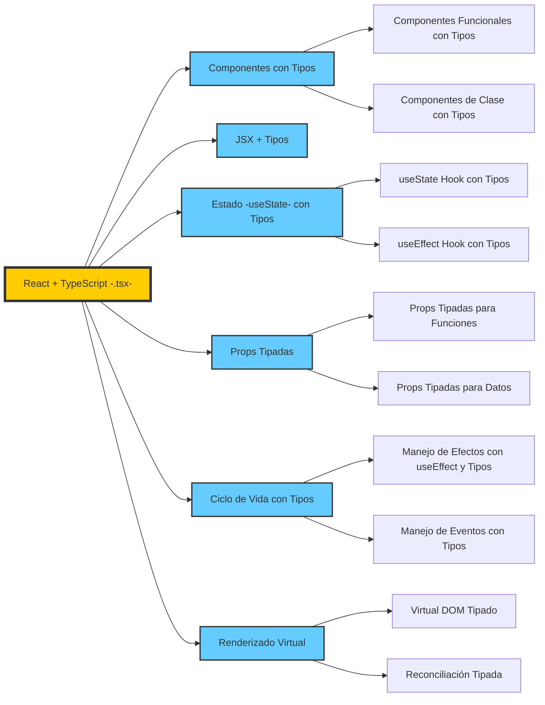
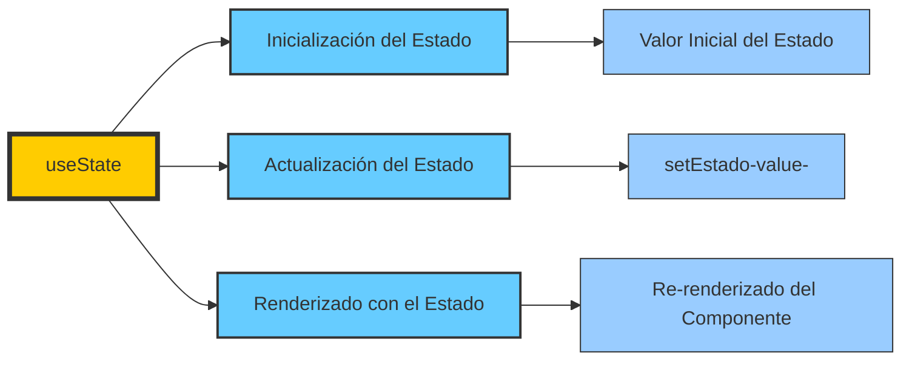
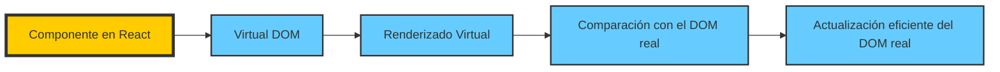

# REACT y TypeScript

 TypeScript se integra con las características principales de React, como el uso de tipos, interfaces, y la seguridad que proporciona al trabajar con los componentes y los hooks.



## Descripción de las Características en React con TypeScript

- **Componentes con Tipos**: El uso de TypeScript permite tipar componentes, ya sea funcionales o de clase, asegurando que las props y el estado estén correctamente definidos.
  - **Componentes Funcionales con Tipos**: Uso de funciones para definir componentes con tipos de props y estado.
  - **Componentes de Clase con Tipos**: Tipar los componentes de clase con las interfaces adecuadas para sus props y estado.

- **JSX + Tipos**: La sintaxis de JSX es compatible con TypeScript, y podemos añadir tipos a los elementos dentro del JSX.

- **Estado (useState) con Tipos**: Utilización de `useState` y su integración con los tipos de datos que se manejarán dentro del estado.
  
- **Props Tipadas**: Podemos definir las props de un componente con interfaces o tipos, asegurando la correcta validación de datos.
  - **Props Tipadas para Funciones**: Tipar las funciones que se pasan como props.
  - **Props Tipadas para Datos**: Asegurar que los datos pasados en las props tengan el tipo adecuado.

- **Ciclo de Vida con Tipos**: Usar hooks como `useEffect` con TypeScript asegura que los efectos y eventos estén correctamente tipados.
  - **Manejo de Efectos con useEffect y Tipos**: Usar efectos secundarios correctamente tipados.
  - **Manejo de Eventos con Tipos**: Tipar los eventos para asegurarse de que las interacciones del usuario sean manejadas correctamente.

- **Renderizado Virtual**: Con TypeScript, el Virtual DOM y la reconciliación están completamente tipados, asegurando que las actualizaciones del DOM sean correctas y eficientes.


### **Profundizar en Componente**

Ejemplo simple de cómo usar una **interfaz** en **TypeScript** dentro de un componente React, usando un formulario de registro como contexto.

```tsx
import React, { useState } from "react";

// 1. Definimos una interfaz para las props del componente.
interface FormularioProps {
  titulo: string;  // Propiedad que recibirá el título del formulario.
}

// 2. Componente funcional con una prop tipada mediante la interfaz FormularioProps.
const FormularioRegistro: React.FC<FormularioProps> = ({ titulo }) => {
  // 3. Definimos los estados del formulario con tipos.
  const [nombre, setNombre] = useState<string>('');
  const [email, setEmail] = useState<string>('');
  const [password, setPassword] = useState<string>('');
  const [confirmPassword, setConfirmPassword] = useState<string>('');
  const [error, setError] = useState<string>('');

  // 4. Función que maneja el envío del formulario.
  const handleSubmit = (e: React.FormEvent) => {
    e.preventDefault();  // Previene la recarga del formulario

    // 5. Validaciones simples del formulario.
    if (!nombre || !email || !password || !confirmPassword) {
      setError("Todos los campos son obligatorios.");
      return;
    }

    if (password !== confirmPassword) {
      setError("Las contraseñas no coinciden.");
      return;
    }

    // 6. Si todo está bien, se limpia el error y se procesa el formulario.
    setError('');
    console.log("Formulario enviado con éxito!");
    console.log({ nombre, email, password });
  };

  // 7. JSX para el formulario de registro.
  return (
    <div>
      <h2>{titulo}</h2>  {/* Mostramos el título que recibimos como prop */}
      <form onSubmit={handleSubmit}>
        <div>
          <label htmlFor="nombre">Nombre:</label>
          <input
            id="nombre"
            type="text"
            value={nombre}
            onChange={(e) => setNombre(e.target.value)}
            required
          />
        </div>

        <div>
          <label htmlFor="email">Email:</label>
          <input
            id="email"
            type="email"
            value={email}
            onChange={(e) => setEmail(e.target.value)}
            required
          />
        </div>

        <div>
          <label htmlFor="password">Contraseña:</label>
          <input
            id="password"
            type="password"
            value={password}
            onChange={(e) => setPassword(e.target.value)}
            required
          />
        </div>

        <div>
          <label htmlFor="confirmPassword">Confirmar Contraseña:</label>
          <input
            id="confirmPassword"
            type="password"
            value={confirmPassword}
            onChange={(e) => setConfirmPassword(e.target.value)}
            required
          />
        </div>

        {/* 8. Mostrar el mensaje de error si existe */}
        {error && <p style={{ color: "red" }}>{error}</p>}

        <button type="submit">Registrarse</button>
      </form>
    </div>
  );
};

export default FormularioRegistro;
```

#### **Explicación del Código:**

1. **Definición de la Interfaz `FormularioProps`**:
   - Se define una **interfaz** llamada `FormularioProps`, que describe las propiedades que el componente `FormularioRegistro` espera recibir. En este caso, solo recibe un **prop** `titulo` de tipo `string`, que se utiliza para mostrar el título del formulario.

2. **Uso de la Interfaz en el Componente**:
   - El componente `FormularioRegistro` se define como un **componente funcional** de React que utiliza la interfaz `FormularioProps` para tipar sus **props**.
   - La prop `titulo` se recibe en el componente y se utiliza en el JSX para mostrar el título del formulario.

3. **Definición de Estados con Tipos**:
   - Los estados como `nombre`, `email`, `password`, `confirmPassword` y `error` están tipados explícitamente como `string` con `useState<string>()`.
   - Esto asegura que solo se puedan almacenar valores de tipo `string` en estos estados.

4. **Manejo del Evento `onSubmit`**:
   - Se define una función `handleSubmit` para manejar el evento de envío del formulario. Esta función previene el comportamiento por defecto del formulario (recarga de página) y realiza algunas validaciones.
   - Si hay algún error (por ejemplo, campos vacíos o contraseñas que no coinciden), se muestra un mensaje de error.

5. **Renderizado del Formulario**:
   - En el JSX del componente, se muestra un formulario con campos de texto, un campo de correo electrónico y dos campos de contraseña.
   - Los valores de los campos están controlados por los estados correspondientes (`useState`), y cada campo tiene un evento `onChange` para actualizar los valores del estado.

6. **Mostrar Errores**:
   - Si hay un mensaje de error, se muestra en un `<p>` con un color rojo. Esto se maneja mediante el estado `error`.

#### Uso del componente

Este componente se puede usar en cualquier parte de la aplicación de la siguiente forma:

```tsx
<FormularioRegistro titulo="Registro de Usuario" />
```

#### **Resumen de beneficios**:

- **Validación de Props**: TypeScript valida que el componente reciba las propiedades adecuadas, garantizando que no se pase un tipo incorrecto.
- **Autocompletado en el IDE**: Cuando se usan interfaces, el editor de código puede proporcionar autocompletado y sugerencias útiles para las props y estados.
- **Seguridad de Tipo**: Gracias a las interfaces, se garantiza que las props y estados tengan los tipos correctos, evitando errores comunes como pasar valores incorrectos.

### **Profundizar en props**

#### **¿Qué son las `props`?**

En **React**, las `props` (abreviatura de "properties") son **valores** que se pasan a un componente desde su componente **padre**. Las `props` son **inmutables** dentro del componente, es decir, no puedes cambiarlas directamente dentro del componente donde las recibes, pero puedes usarlas para renderizar contenido dinámico o para controlar el comportamiento del componente.

#### **¿Por qué usamos `props`?**

Las `props` permiten que los componentes sean **reutilizables** y **personalizables**. Es como si estuvieras pasando **parámetros** a una función. Cuando usas componentes en React, los puedes personalizar pasándoles diferentes valores a través de las `props`, lo que les permite comportarse de manera diferente dependiendo de esos valores.

#### **Ejemplo Básico con `props`**

Supón que tienes un componente de saludo que muestra un mensaje. Aquí te muestro cómo las `props` permiten personalizar el saludo:

#### **Componente que recibe `props`**

```tsx
// Este componente recibe una prop llamada `nombre`
function Saludo({ nombre }: { nombre: string }) {
  return <h1>Hola, {nombre}!</h1>;
}
```

- El componente `Saludo` tiene una prop llamada `nombre`, que se usa para mostrar un mensaje personalizado.
- La prop `nombre` se pasa al componente cuando lo usas en otro lugar.

#### **Componente Padre que pasa `props`**

```tsx
function App() {
  return (
    <div>
      <Saludo nombre="Juan" />  {/* Aquí estamos pasando la prop 'nombre' */}
      <Saludo nombre="María" /> {/* Otra vez, pasamos un valor diferente */}
    </div>
  );
}
```

- El componente `App` es el **componente padre**, y pasa los valores `"Juan"` y `"María"` como `props` al componente `Saludo`.
- Como resultado, el componente `Saludo` renderiza dos mensajes diferentes: "Hola, Juan!" y "Hola, María!".

#### **¿Cómo se usan las `props`?**

Las `props` se utilizan dentro del componente para:

1. **Renderizar contenido dinámico**: Como en el ejemplo anterior, donde mostramos un saludo con el valor de la prop `nombre`.
2. **Controlar el comportamiento**: Puedes pasar funciones como `props` para que un componente pueda hacer algo en respuesta a un evento (como en tu ejemplo anterior, pasando una función para manejar cambios en el input).

#### **Tipos de `props`**

- **Datos**: Como en el caso de `nombre`, donde pasas un valor de texto, número o cualquier tipo de dato.

- **Funciones**: Como en el ejemplo de `onInputNumeroInput`, donde pasas una función que manejará un evento, como el cambio de valor en un input.

#### **Resumen**

- Las `props` son valores que los **componentes padres** pasan a los **componentes hijos**.
- Son **inmutables**, lo que significa que no puedes cambiarlas directamente dentro del componente hijo.
- Las `props` permiten que un componente sea **reutilizable** y **dinámico**.

---

### **Profundizar en `useState`**



#### **Explicación del gráfico:**

1. **`useState`**:
   - Es un hook que se utiliza para gestionar el estado en componentes funcionales.
   
2. **Inicialización del Estado**:
   - `useState` se inicializa con un valor, que se establece como el valor inicial del estado (por ejemplo, un número, texto, o un objeto).

3. **Actualización del Estado**:
   - La actualización del estado se realiza mediante la función `setEstado`, que se obtiene al llamar a `useState`.

4. **Renderizado con el Estado**:
   - Cuando el estado se actualiza, React realiza un **re-renderizado** del componente para reflejar los nuevos valores del estado en la interfaz.

---

#### **Ejemplo para Gestionar los Resultados de un Cuestionario con `useState`**

Vamos a suponer que estamos gestionando un **cuestionario** con respuestas múltiples y queremos almacenar los resultados usando **`useState`**.

```tsx
import React, { useState } from "react";

// Definimos una interfaz para el tipo de respuestas
interface Respuestas {
  nombre: string;
  edad: string;
  respuesta1: string;
  respuesta2: string;
}

const Cuestionario: React.FC = () => {
  // 1. Inicializamos el estado para almacenar las respuestas del cuestionario
  const [respuestas, setRespuestas] = useState<Respuestas>({
    nombre: '',
    edad: '',
    respuesta1: '',
    respuesta2: ''
  });

  // 2. Función para manejar los cambios en los campos del formulario
  const handleChange = (e: React.ChangeEvent<HTMLInputElement>) => {
    const { name, value } = e.target;
    setRespuestas((prevRespuestas) => ({
      ...prevRespuestas,
      [name]: value
    }));
  };

  // 3. Función para manejar el envío del formulario
  const handleSubmit = (e: React.FormEvent) => {
    e.preventDefault();
    // 4. Mostrar las respuestas al enviar el cuestionario
    console.log("Respuestas del cuestionario:", respuestas);
  };

  // 5. El formulario de cuestionario
  return (
    <div>
      <h2>Cuestionario</h2>
      <form onSubmit={handleSubmit}>
        {/* Campo de nombre */}
        <div>
          <label htmlFor="nombre">Nombre:</label>
          <input
            id="nombre"
            type="text"
            name="nombre"
            value={respuestas.nombre}
            onChange={handleChange}
          />
        </div>

        {/* Campo de edad */}
        <div>
          <label htmlFor="edad">Edad:</label>
          <input
            id="edad"
            type="text"
            name="edad"
            value={respuestas.edad}
            onChange={handleChange}
          />
        </div>

        {/* Pregunta 1 */}
        <div>
          <label htmlFor="respuesta1">¿Te gusta React?</label>
          <input
            id="respuesta1"
            type="text"
            name="respuesta1"
            value={respuestas.respuesta1}
            onChange={handleChange}
          />
        </div>

        {/* Pregunta 2 */}
        <div>
          <label htmlFor="respuesta2">¿Te gustaría aprender más sobre React?</label>
          <input
            id="respuesta2"
            type="text"
            name="respuesta2"
            value={respuestas.respuesta2}
            onChange={handleChange}
          />
        </div>

        {/* Botón de enviar */}
        <button type="submit">Enviar Respuestas</button>
      </form>
    </div>
  );
};

export default Cuestionario;
```

#### **Explicación del Código**

1. **Inicialización del Estado con `useState`**:
   - Inicializamos el estado `respuestas` con un objeto que contiene los campos de `nombre`, `edad`, `respuesta1`, y `respuesta2`. Todos estos campos empiezan con valores vacíos (`''`).

2. **Función `handleChange`**:
   - Esta función se llama cada vez que el usuario escribe algo en un campo del formulario.
   - Utiliza la propiedad `name` del `input` para identificar qué campo está siendo modificado y actualiza solo ese campo en el estado utilizando `setRespuestas`.

3. **Función `handleSubmit`**:
   - Cuando el usuario envía el formulario, esta función se ejecuta, previene el comportamiento por defecto del formulario (que recargaría la página), y muestra las respuestas en la consola.

4. **Formulario**:
   - Los campos de entrada (`input`) tienen el valor vinculado a los estados (`value={respuestas.nombre}`), y cada cambio se maneja con el evento `onChange`, que actualiza el estado utilizando `handleChange`.

5. **Al enviar el formulario**, el estado completo de las respuestas se muestra en la consola.

---

#### **Resumen**

- **`useState`** se utiliza para gestionar el estado de las respuestas del cuestionario.
- Cada vez que el usuario cambia el valor en un campo del formulario, el estado se actualiza.
- Al enviar el formulario, el estado completo con las respuestas se muestra en la consola.

Este ejemplo muestra cómo usar **`useState`** para gestionar los resultados de un cuestionario y actualizar el estado de manera dinámica en función de las respuestas del usuario.

---


Sí, efectivamente. El **renderizado virtual**, el **Virtual DOM tipado** y la **reconciliación tipada** son procesos **automáticos** gestionados por **React**, y el programador no necesita intervenir directamente en ellos. React se encarga de todo el proceso para optimizar el rendimiento y la gestión del DOM, lo que facilita el trabajo del desarrollador.

### **Profundizar en Procesos Automáticos**



1. **Renderizado Virtual**:
   - Cuando el estado o las props de un componente cambian, React **automáticamente** crea un nuevo Virtual DOM. Este proceso ocurre sin intervención directa del programador. El Virtual DOM es solo una representación en memoria de cómo debería verse la interfaz de usuario.
   
2. **Virtual DOM Tipado**:
   - Si usas **TypeScript** (o cualquier otro sistema de tipos), el tipado de los datos que componen el Virtual DOM ayuda a **garantizar la seguridad** y la **consistencia** de los datos. **React** se encarga de validar y manejar estos tipos de forma automática, y el programador solo necesita definir los tipos correctamente cuando crea componentes, pero no tiene que gestionar manualmente el Virtual DOM.
   
3. **Reconciliación Tipada**:
   - Cuando el estado del componente cambia, React realiza automáticamente el proceso de reconciliación para comparar el Virtual DOM actualizado con el anterior, y determinar qué partes del DOM real deben actualizarse. React se ocupa de comparar las dos versiones del Virtual DOM y de aplicar solo los cambios necesarios para optimizar el rendimiento.

#### **Lo que el Programador Hace**:

- **Definir Componentes**: El programador define los componentes React, especificando cómo deben renderizarse en función de las props y el estado.
- **Establecer Tipos (en caso de usar TypeScript)**: Si se está utilizando TypeScript, el programador puede definir los tipos de los props y el estado, pero React se encarga de cómo esos tipos se aplican en el Virtual DOM y la reconciliación.
- **Gestionar el Estado y las Props**: El programador se ocupa de cambiar el estado de los componentes o pasar las props, lo que desencadena el proceso automático de renderizado y reconciliación en React.

#### **Resumen**:

- **Automático**: React maneja el proceso de renderizado virtual y reconciliación sin que el programador tenga que hacerlo manualmente. El programador solo se enfoca en **definir el estado, las props y la estructura del componente**.
- **Tipado (si usas TypeScript)**: Aunque el programador define los tipos de datos, React se encarga de validarlos y procesarlos internamente.

Este sistema automático facilita que los desarrolladores no tengan que preocuparse por las optimizaciones de rendimiento del DOM, y puedan centrarse en la lógica de la aplicación.

---